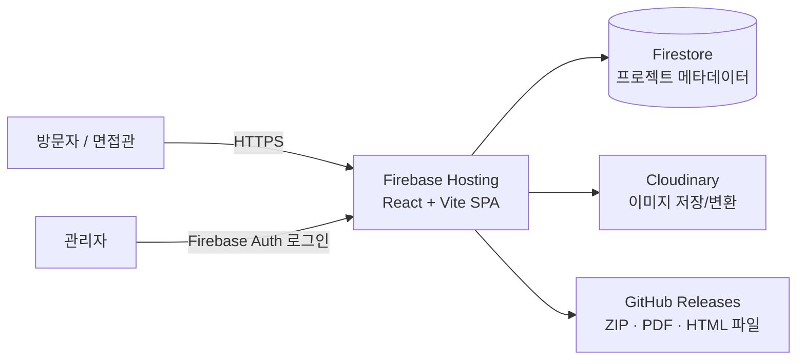

# PPS — Personal Portfolio Server

> 개인 프로젝트, 프로그램, 교육자료, 통계자료를 체계적으로 관리하고,
> **URL 하나로 포트폴리오 전체를 보여주는** 웹 기반 포트폴리오 서버

[]()
[]()
[]()

<!-- 배포 후 실제 URL로 교체 -->
🔗 **Live Demo**: https://YOUR-PROJECT.web.app

---

## 📌 프로젝트 소개

기업 면접 시 "포트폴리오 보여주세요"라는 요청에 URL 하나로 답하기 위한 프로젝트입니다.
개인이 만든 프로그램(.exe), PPT로 제작한 교육자료(PDF 변환), 통계자료 등을
카테고리·연도·태그로 관리하고, 파일 업로드/다운로드와 상세 페이지를 제공합니다.

### 핵심 기능

| 기능 | 설명 |
|---|---|
| 📊 대시보드 | 카테고리별 건수 도넛 차트, 연도별 등록 추이 막대 차트, 요약 카드, 최근 등록 목록 |
| 🗂 카테고리 관리 | 프로그램 / 교육자료 / 통계자료 3개 카테고리, 연도·태그 필터 |
| 📄 프로젝트 상세 | 제작사유 / 결과 / 이미지 갤러리(클릭 시 라이트박스 확대) / 첨부파일 다운로드 |
| 📁 파일 관리 | PDF, ZIP, PPT, HTML, 이미지 등 다양한 형식 지원 |
| 🔍 검색 & 태그 | 제목·태그 기반 검색 |
| 🔒 공개/비공개 | 비공개 항목은 관리자 로그인 시에만 노출 |
| 📱 반응형 웹 | 모바일 / 태블릿 / 데스크톱 대응 |

---

## 🏗 아키텍처



### 기술 스택 & 무료 운영 전략

| 구분 | 기술 | 무료 한도 |
|---|---|---|
| 프론트엔드 | React 18 + Vite | - |
| 호스팅 | Firebase Hosting (Spark) | 저장 10GB / 월 전송 360MB·일 |
| DB | Cloud Firestore (Spark) | 1GiB 저장 / 일 50K 읽기 |
| 인증 | Firebase Auth (이메일) | 무제한 (기본 제공) |
| 이미지 | Cloudinary Free | 월 25 크레딧 (≈25GB) |
| 파일(ZIP/PDF/HTML) | GitHub Releases | 파일당 2GB, 총량 제한 없음 |
| 차트 | Chart.js + react-chartjs-2 | - |

> ⚠️ Firebase Storage는 2024년 10월 이후 신규 프로젝트에서 Blaze 플랜이 필요하므로,
> **완전 무료 운영**을 위해 Cloudinary(이미지) + GitHub Releases(문서/압축파일) 조합을 사용합니다.

---

## 📂 폴더 구조

```
PPS/
├── public/                  # 정적 리소스 (favicon, og 이미지)
├── src/
│   ├── components/
│   │   ├── common/          # Header, Footer, SearchBar, TagChip ...
│   │   ├── dashboard/       # SummaryCards, CategoryDonut, YearlyBar, RecentList
│   │   ├── project/         # ProjectCard, ProjectGrid, ImageLightbox, FileList
│   │   └── admin/           # ProjectForm, ImageUploader, LoginForm
│   ├── pages/
│   │   ├── Dashboard.jsx    # /            대시보드
│   │   ├── CategoryList.jsx # /category/:id 카테고리별 목록
│   │   ├── ProjectDetail.jsx# /project/:id  상세 페이지
│   │   └── Admin.jsx        # /admin        등록/수정 (로그인 필요)
│   ├── services/
│   │   ├── firebase.js      # Firebase 초기화
│   │   ├── projects.js      # Firestore CRUD
│   │   └── cloudinary.js    # 이미지 업로드 (unsigned preset)
│   ├── hooks/               # useProjects, useAuth, useSearch
│   ├── styles/              # 전역 스타일, 반응형 브레이크포인트
│   └── App.jsx
├── skills/                  # 작업 규정 스킬 모음 (하네스에 등록)
│   ├── ui-consistency.md            # 스크롤바/팝업/레이아웃 정합성 규정
│   └── make-interfaces-feel-better.md # 레이아웃 울렁거림 방지 등 폴리싱 규정
├── firestore.rules          # 보안 규칙 (공개 읽기 / 관리자만 쓰기)
├── firebase.json            # Hosting 설정
├── HARNESS.md               # 규정/스킬 중앙 인덱스 (루프엔지니어링)
├── CLAUDE.md                # AI 어시스턴트용 프로젝트 컨텍스트
├── SKILLS.md                # 사용 기술 및 참조 자료 정리
└── README.md
```

---

## 🗃 데이터 모델 (Firestore)

`projects` 컬렉션:

```js
{
  title: "프로그램명",
  category: "program" | "education" | "statistics",
  year: 2026,
  tags: ["C#", "자동화"],
  reason: "제작 사유",          // 왜 만들었는가
  result: "결과 및 성과",       // 무엇을 얻었는가
  description: "상세 설명 (마크다운 지원)",
  images: [                     // Cloudinary URL
    { url: "https://res.cloudinary.com/...", caption: "메인 화면" }
  ],
  files: [                      // GitHub Releases URL
    { name: "설치파일.zip", url: "https://github.com/.../releases/...", size: "12MB", type: "zip" },
    { name: "사용매뉴얼.pdf", url: "...", size: "3MB", type: "pdf" }
  ],
  isPublic: true,
  createdAt: Timestamp,
  updatedAt: Timestamp
}
```

---

## 🚀 시작하기

### 1. 사전 준비

- Node.js 18+
- [Firebase 콘솔](https://console.firebase.google.com)에서 프로젝트 생성 (Spark 플랜)
  - Firestore Database 활성화
  - Authentication → 이메일/비밀번호 활성화 후 관리자 계정 1개 생성
- [Cloudinary](https://cloudinary.com) 무료 가입 → Settings > Upload > **unsigned upload preset** 생성

### 2. 설치 및 실행

```bash
git clone https://github.com/hiordersh/PPS.git
cd PPS
npm install

# 환경변수 설정
cp .env.example .env
# .env에 Firebase 설정값과 Cloudinary cloud name / preset 입력

npm run dev        # 개발 서버 (http://localhost:5173)
```

### 3. 배포

```bash
npm install -g firebase-tools
firebase login
firebase init hosting   # dist 폴더 지정, SPA rewrite: yes
npm run build
firebase deploy
```

### 4. 파일 등록 워크플로우

1. **이미지**: 관리자 페이지에서 직접 업로드 (Cloudinary 자동 처리)
2. **ZIP/PDF/HTML**: GitHub 저장소 → Releases → 파일 첨부 후 다운로드 URL 복사 → 등록 폼에 붙여넣기

---

## 🔐 보안 규칙 요약

```
// firestore.rules
- 읽기: isPublic == true 는 누구나, 비공개는 인증된 관리자만
- 쓰기: 인증된 관리자만
```

---

## 🗺 로드맵

- [x] 요구사항 정의 및 아키텍처 설계
- [ ] Firebase 프로젝트 셋업 + 인증
- [ ] 대시보드 (요약 카드 + 도넛/막대 차트 + 최근 등록)
- [ ] 카테고리별 목록 + 검색/태그/연도 필터
- [ ] 프로젝트 상세 페이지 (라이트박스, 파일 다운로드)
- [ ] 관리자 등록/수정 페이지
- [ ] 반응형 스타일링 및 배포
- [ ] (선택) 다크모드, 방문자 카운트, 커스텀 도메인

---

## 📄 라이선스

MIT License

## 👤 만든 사람

**hiordersh** — [GitHub](https://github.com/hiordersh)
